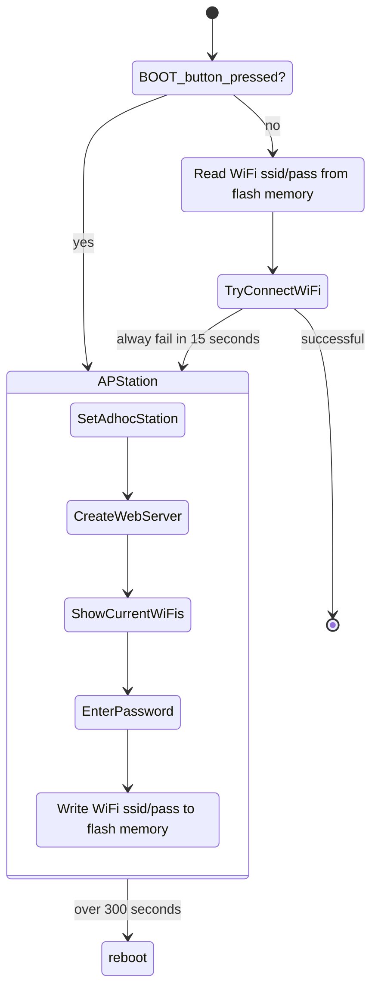

# SOICT CORE Version 2

## Enviroment

- IDE: Visual Studio Code + Platform IO
- Architecture: esp32,esp8266
  - Tested: [esp32doit-devkit-v1](https://docs.platformio.org/en/latest/boards/espressif32/esp32doit-devkit-v1.html), [esp32-c3-devkitm-1](https://docs.espressif.com/projects/esp-idf/en/v5.0/esp32c3/hw-reference/esp32c3/user-guide-devkitm-1.html)
  - Tested: [Wemos D1 Mini V3.0.0](https://grobotronics.com/wemos-d1-mini-esp8266-v2.0.html?sl=en)

---

## Features

1. [Enroll WiFi by Adhoc WebServer](#enroll-wifi-by-adhoc-webserver)
---

## Enroll WiFi by Adhoc WebServer

```Arduino
#include <Arduino.h>
#include <siot_core_lib.h>   // SIOT Core Lib - all packages or you could select each package manually.

// Handler adhoc wifi station
WiFiSelfEnroll MyWiFi;

void setup() {
  //just for debug
  Serial.begin(115200);
  // Make sure WiFi ssid/password is correct. Otherwise, raise the Adhoc AP Station with ssid = SOICT_CORE_BOARD and password =  12345678
  MyWiFi.setup();
  // TODO something
}

void loop() {
  Serial.println(MyWiFi.GetDeviceID());
  Serial.printf("  %s / %s \n", MyWiFi.GetSSID(), MyWiFi.GetPassword());
  delay(1000);
}
```

  

### Workflow inside


