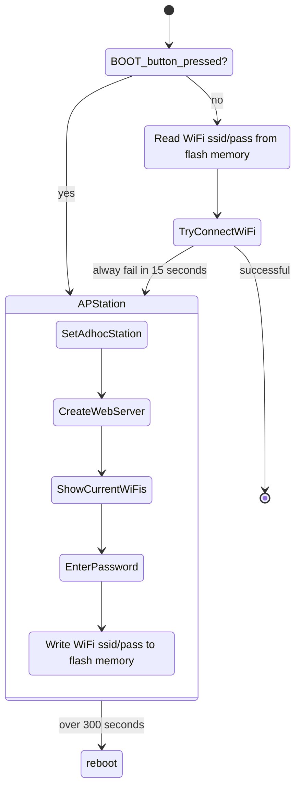

# SOICT CORE Version 2

## Enviroment

- IDE: Visual Studio Code + Platform IO
- Device: ESP32, ESP32-C3

---

## Features

1. [Enroll WiFi by Adhoc WebServer](#enroll-wifi-by-adhoc-webserver)

---

### Enroll WiFi by Adhoc WebServer

```Arduino
#include <Arduino.h>
#include "WiFiSelfEnroll.h"

WiFiSelfEnroll MyWiFi;

void setup() {
  // Make sure WiFi ssid/password is correct. Otherwise, raise the Adhoc AP Station with ssid = SOICT_CORE_BOARD and password =  12345678
  MyWiFi.setup();
  // TODO something
}

void loop() {
  Serial.printf("%s:  %s / %s \n", MyWiFi.GetDeviceID(), MyWiFi.GetSSID(), MyWiFi.GetPassword());
  delay(1000);
}
```

  

## Workflow inside

