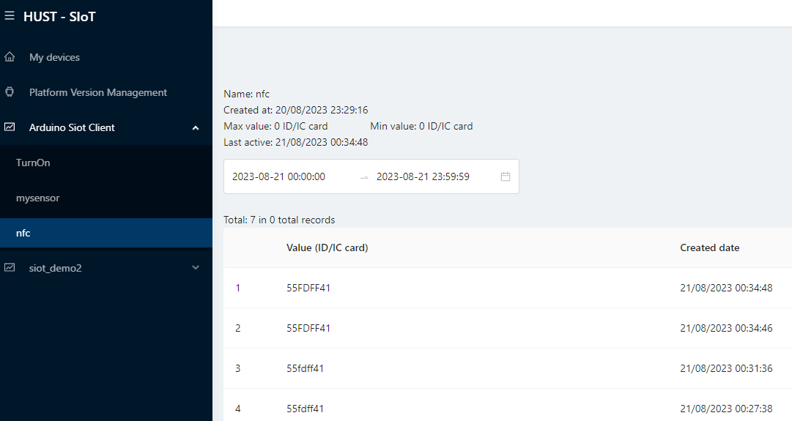
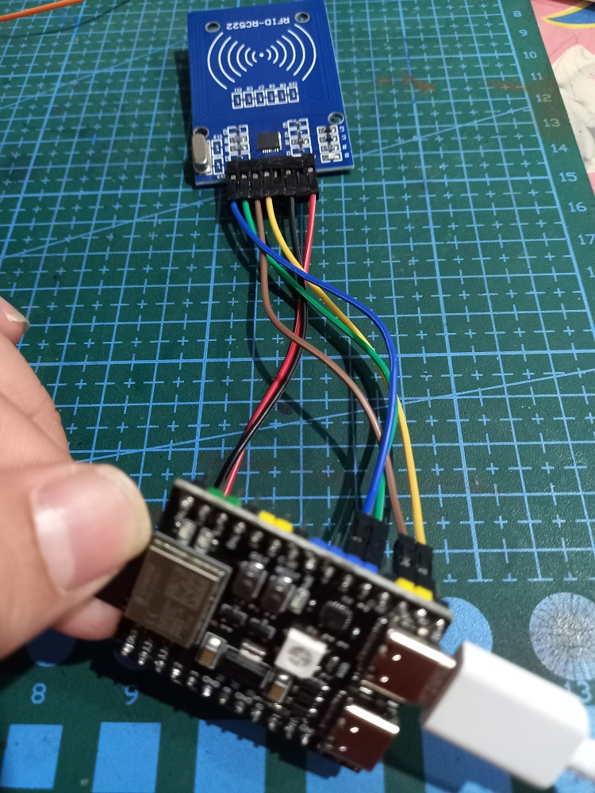

# NFC READER

## Overview

- Put your NFC Card (13.56HMz) over the NFC reader module
- to view the NFC card:
  - acccess the SIoT Data Hub website, or
  - connect the device via rs232 cable with baud-rate 115200, or

  


## Pins and codes for board DOIT ESP32 DevKit

```Arduino
#define SS_PIN 21     //   SS/SDA
#define RST_PIN 0    //   Reset
```

*In the example, pin settings are changed automatically by your board setting. So you just connect board to MRC522 as images belows and keep the source code.*

[](https://www.youtube.com/embed/VQAy33XYFEY?si=405xoTWnA44ltDjW "Video Title")


## Pins and codes for board ESP32-C3-DevKitM-1 dual USB

```Arduino
  #define SS_PIN   5      //SS/SDA
  #define SCLK_PIN 4  
  #define MOSI_PIN 18 
  #define MISO_PIN 19 
  #define RST_PIN   0 
```

*In the example, pin settings are changed automatically by your board setting. So you just connect board to MRC522 as images belows and keep the source code.*




## Pins and codes for board Wemos D1 mini

```Arduino
  #define SS_PIN   15 
  #define RST_PIN  0
```

*In the example, pin settings are changed automatically by your board setting. So you just connect board to MRC522 as images belows and keep the source code.*


